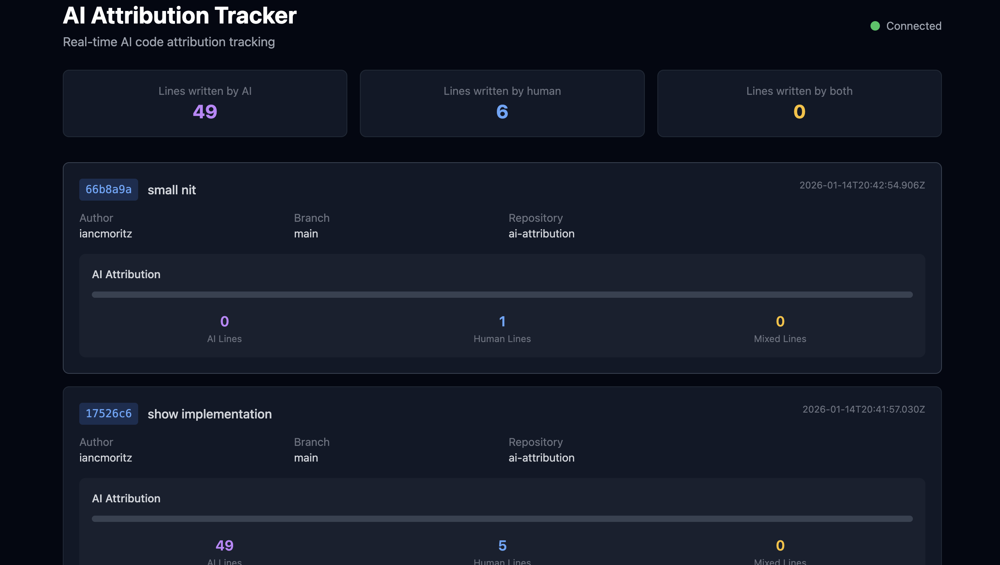

# Windsurf Hooks And AI Attribution Example

This repo is a demo of using Windsurf hooks to collect AI attribution data. It includes a simple UI to view the data in real-time.



Note: this only works in Windsurf and has only been tested on MacOS

# Setup: 

1. Clone this repo
2. Run setup.sh to install the appropriate git-ai CLI and configure git hooks 

# Running the UI to Track Commits
1. Install npm (https://nodejs.org/)
1. ```cd demo-ui```
2. ```npm run dev```

# Learn More

See [HOW_THIS_WORKS.md](HOW_THIS_WORKS.md) for a detailed explanation.